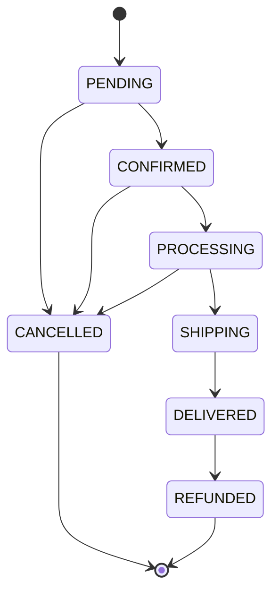

# Architecture Overview

## Overview

This is a Vietnamese e-commerce backend built with Node.js, Express, TypeScript, and TypeORM on MySQL. It supports a full online shopping platform including product catalogue management, direct checkout (no persistent cart), multi-method checkout, order lifecycle management, real-time notifications and chat via Socket.IO, and integrations with VNPay and MoMo payment gateways.

Key capabilities:
- Product management with variants, inventory tracking, and image hosting via Cloudinary
- Order processing with a defined state machine and full status history
- Two online payment gateways (VNPay, MoMo) plus COD and bank transfer
- Real-time communication: order status feeds, chat, notifications via Socket.IO
- JWT access tokens with DB-backed rotating refresh tokens (session management)
- Application-level caching via Redis (CacheUtil read-through pattern)
- Flash sales, coupons, product reviews, and shipping management

---

## Tech Stack

| Layer | Technology |
|---|---|
| Runtime | Node.js |
| Language | TypeScript 5.2 |
| Web framework | Express 4.18 |
| ORM | TypeORM 0.3 |
| Database | MySQL (mysql2 driver) |
| Cache | Redis (ioredis 5) |
| Real-time | Socket.IO 4.6 |
| Auth | jsonwebtoken 9, bcrypt 5 |
| Validation | class-validator, class-transformer |
| Image storage | Cloudinary SDK |
| Email | Nodemailer |
| File upload | Multer |
| Security | helmet, cors, express-rate-limit |
| API docs | swagger-jsdoc + swagger-ui-express |

---

## Layer Architecture

Each HTTP request passes through a strict sequence of layers. No layer should reach past the one immediately below it.

```
HTTP/WebSocket Request
        |
        v
[ Middlewares ]   helmet, cors, rate-limit, auth, validation, upload
        |
        v
[ Routes ]        src/routes/ — URL → middleware + controller mapping
        |
        v
[ Controllers ]   src/controllers/ — req/res, ResponseUtil
        |
        v
[ Services ]      src/services/ — business logic, QueryRunner transactions
        |
        v
[ Repositories ]  src/repositories/ — TypeORM data access
        |
        v
[ Entities ]      src/entities/ — DB schema source of truth
        |
        v
      MySQL

Side channels:
  Socket.IO ──────── shares HTTP server (port 5000)
  Redis ──────────── CacheUtil (read-through cache)
  Cloudinary ─────── image upload from services
  VNPay / MoMo ───── payment webhooks enter at public routes
  Nodemailer ─────── SMTP from service layer
```

### Layer Responsibilities

| Layer | Directory | Responsibility |
|---|---|---|
| Middlewares | `src/middlewares/` | Cross-cutting concerns: authentication, input validation, rate limiting, file upload, error formatting |
| Routes | `src/routes/` | Declare URL patterns, attach middleware chains, delegate to controllers. Admin sub-routes live in `src/routes/admin/` |
| Controllers | `src/controllers/` | Parse `req`, call one service method, use `ResponseUtil` to send the response. No business logic. Admin controllers in `src/controllers/admin/` |
| Services | `src/services/` | All business logic, multi-step database operations via `QueryRunner` for atomicity, orchestration of external calls |
| Repositories | `src/repositories/` | All TypeORM data access. Wraps `AppDataSource.getRepository()`. No business logic |
| Entities | `src/entities/` | TypeORM entity definitions. These are the authoritative schema. 34 entity files total |
| DTOs | `src/dtos/` | Input shapes validated by class-validator. One DTO file per domain |
| Utils | `src/utils/` | Stateless helpers: `ResponseUtil`, `CacheUtil`, `JwtUtil`, `BcryptUtil`, `VNPayUtil`, `MomoUtil`, `PricingUtil`, `EmailUtil`, `SlugUtil` |
| Config | `src/config/` | External service connections: `AppDataSource` (TypeORM), `redis` (ioredis), `cloudinary`, `vnpay`, `momo`, `socket` |
| Errors | `src/errors/` | Typed error classes (`AppError`, `NotFoundError`, `UnauthorizedError`, `ValidationError`) caught by `errorHandler` middleware |
| Sockets | `src/sockets/` | Socket.IO server setup, auth middleware, connection/disconnect handlers, event emitters |

---

## Startup Sequence

The server startup order in `src/index.ts` is critical and must not be reordered:

1. **MySQL connection (TypeORM)** — `AppDataSource.initialize()` must succeed. If it fails, the process exits with code 1. The server cannot start without a database connection.
2. **Socket.IO initialized** — `setupSocketServer(httpServer)` is called only after the database is confirmed up. Socket handlers use repositories that depend on the database.
3. **HTTP server begins listening** — `httpServer.listen(PORT)` starts only after Socket.IO is wired. The server is available on port 5000 (default) for both HTTP and WebSocket traffic.

---

## Authentication Architecture

### Token Model

- **Access tokens**: short-lived JWTs signed with `JWT_SECRET`. Carry `{ userId, email, role }` in the payload. Verified on every authenticated request.
- **Refresh tokens**: longer-lived JWTs (7 days) stored as rows in the `UserSession` table alongside metadata (`userAgent`, `ipAddress`, `expiresAt`). On use, the old session row is deleted and a new one is created (token rotation). This makes refresh tokens single-use and revocable.

### HTTP Authentication

The `authenticate` middleware reads the `Authorization: Bearer <token>` header, verifies the access token via `JwtUtil.verifyAccessToken`, confirms the user exists and is active, then attaches the user to `req.user`.

The `authorize(...roles)` middleware runs after `authenticate` and checks `req.user.role` against the allowed role set.

An `optionalAuth` middleware is also provided for routes that benefit from user context when available but do not require it (e.g., product views, cart operations).

### Socket.IO Authentication

Socket auth middleware validates the JWT at the Socket.IO handshake phase. Unauthenticated handshake attempts are rejected before any connection handler runs.

### Role Tiers

| Tier | Roles | Typical routes |
|---|---|---|
| Public | (none) | Product browse, search, payment webhooks |
| Authenticated | `customer`, `staff`, `admin` | Orders, profile, checkout |
| Admin/Staff | `staff`, `admin` | Admin order management, analytics, coupons |
| Admin only | `admin` | User management, settings, sensitive admin actions |

### Session Invalidation

Both `resetPassword` and `changePassword` in `AuthService` delete all refresh token rows for the user. This forces re-login on all devices after a password change.

---

## Order State Machine

Orders follow a strict state machine. Invalid transitions are rejected at the service layer.



**Key invariant**: Order item prices (`unitPrice`, `totalPrice`) are snapshotted from the product variant's price at the moment the order is created. These values are immutable after creation. Price changes on the product or variant do not retroactively affect existing orders.

Every status transition is recorded as a row in `OrderStatusHistory` with an optional `note` field.

---

## Checkout Architecture

The checkout flow is **cart-less** — items are passed directly in the request body, not retrieved from a persisted cart.

### Direct Checkout Flow

1. Client sends an array of `CheckoutItemDto` (productId, variantId, quantity, buyingUnitType)
2. `CheckoutService.resolveItems()` looks up current prices server-side based on unit type (individual price or bulk/box price)
3. Stock is validated and reserved
4. Coupon applied if provided
5. Order and OrderItems are created in a single QueryRunner transaction
6. All orders are **guest orders** — no authenticated user session required

### Unit Types & Bulk Pricing

Products support multiple selling unit types:

| Field | Purpose |
|---|---|
| `unitType` | Primary selling unit (`cuon`, `thung`, `cai`) |
| `unitsPerBox` | Sub-units per box (e.g., 50 rolls per box) |
| `boxSubUnit` | Sub-unit type when selling by box |
| `boxPrice` | Price when selling by box/thung |

OrderItems snapshot the `unitType` at purchase time to preserve the buying context.

### Order Confirmation (Chatbot Flow)

The chatbot can create orders via a token-based confirmation flow:

1. Chatbot tool `create_order_confirmation` generates a confirmation with a 1-hour expiry token
2. Customer receives a confirmation URL
3. On confirmation: order is created, customer is found-or-created by phone, admin is notified via Socket.IO

---

## Socket.IO Topology

Socket.IO shares the Express HTTP server on port 5000. Authentication is enforced at the handshake for all connections — there are no unauthenticated socket connections permitted.

### Rooms

| Room | Joined by | Purpose |
|---|---|---|
| `user:{userId}` | Every authenticated user on connect | Personal notifications and order updates |
| `conversation:{conversationId}` | Users who are participants in that conversation | Chat messages, typing indicators, read receipts |
| `orders` | Users with `admin` or `staff` role | Admin order feed, low-stock alerts |

### Key Emitted Events

| Event | Room/Socket | Payload summary |
|---|---|---|
| `message:new` | `conversation:{id}` | New chat message + conversationId |
| `message:typing` | `conversation:{id}` | userId, username, isTyping flag |
| `message:read` | `conversation:{id}` | userId, messageId, readAt |
| `message:edited` | `conversation:{id}` | Updated message object |
| `message:deleted` | `conversation:{id}` | messageId |
| `notification:new` | `user:{id}` | Full notification object |
| `notification:count` | `user:{id}` | `{ unreadCount }` |
| `order:new` | `orders` | New order object (admin feed) |
| `order:updated` | `user:{id}` + `orders` | Updated order object |
| `order:status_changed` | `user:{id}` | `{ orderId, status, note }` |
| `product:stock_low` | `orders` | Product object with low stock |
| `conversation:user_status` | `conversation:{id}` | `{ userId, isOnline, lastSeenAt }` |

### On Connect

When a socket connects, the handler immediately:
1. Joins the personal room `user:{userId}`
2. Joins all `conversation:{id}` rooms the user participates in
3. Joins the `orders` room if the user is admin or staff
4. Emits `notification:count` with the current unread notification count

---

## Payment Architecture

Four payment methods are supported: `cod`, `vnpay`, `momo`, `bank_transfer`.

### VNPay

- **Signature algorithm**: HMAC-SHA512 using `VNPAY_HASH_SECRET`
- **Flow**: Service builds a signed payment URL. The customer is redirected to VNPay. After payment, VNPay redirects back to the configured `returnUrl`. The return handler verifies the HMAC signature before processing any state changes.
- **Currency**: VND only. Amounts are multiplied by 100 when sent to VNPay and divided by 100 on return.
- **Duplicate protection**: If a payment row is already `COMPLETED`, the return handler returns early without re-processing.

### MoMo

- **Signature algorithm**: HMAC-SHA256 using `MOMO_SECRET_KEY`
- **Flow**: Service calls MoMo's create API (`captureWallet` request type) to obtain a `payUrl`. Customer is redirected. MoMo sends both a redirect (`returnUrl`) and a server-to-server IPN (`notifyUrl`). Signatures must be verified on both.
- **Duplicate protection**: Same early-return guard as VNPay.

### COD and Bank Transfer

COD returns a simple confirmation. Bank transfer returns static bank account details for manual payment.

### Production Requirement

VNPay and MoMo require publicly accessible URLs for their return and IPN callbacks. Local development requires a tunnel tool such as ngrok. Without a public URL, payment callbacks will not reach the server and payment status will remain `PENDING`.

---

## External Dependencies

| Service | Client | Purpose |
|---|---|---|
| MySQL | TypeORM (`mysql2` driver) | Primary data store |
| Redis | ioredis (`CacheUtil` wrapper) | Application-level caching |
| Socket.IO | socket.io | Real-time communication (notifications, chat, order feed) |
| Cloudinary | cloudinary SDK | Image upload, storage, and CDN delivery |
| VNPay | Custom HTTPS via `VNPayUtil` | Online payment gateway (redirect flow, HMAC-SHA512) |
| MoMo | Custom HTTPS | Mobile wallet payment (captureWallet, HMAC-SHA256) |
| Email | Nodemailer | Transactional email: verification, password reset, welcome |

---

## AI Chatbot Architecture

An AI-powered shopping assistant that helps customers browse products, check orders, and place orders through natural conversation.

### Provider

Google Gemini (2.5-flash model) via `src/services/ai/gemini.adapter.ts`. The provider adapter pattern (`ai-provider.adapter.ts`) allows swapping to other LLMs.

### Conversation Flow

1. Customer sends a message via the chatbot endpoint
2. `AIChatbotService` loads conversation history from Redis (TTL: 2 hours, max 15 messages)
3. Rate limiting enforced (10 messages/minute per session)
4. The AI model is called with available tools (function calling)
5. Tool calls are executed (max 3 per message) via `ChatbotToolsService`
6. Final response is returned and history updated

### Tools (10)

| Tool | Purpose |
|---|---|
| `search_products` | Scored relevance search with caching |
| `get_product_detail` | Full product details with flash sale info |
| `get_active_promotions` | Active flash sales |
| `get_categories` | Category listing |
| `lookup_customer_by_phone` | Customer lookup with last order address |
| `get_order_history` | Order lookup by phone/email |
| `get_order_status` | Order tracking with shipment updates |
| `get_active_coupons` | Valid coupons |
| `create_order_confirmation` | Generate confirmation link (1-hour expiry token) |
| `escalate_to_human` | Hand off to human agent |

### Knowledge Cache

The `ChatKnowledge` table caches Q&A pairs with automatic expiry (1–24 hours depending on question type). This reduces redundant AI calls for frequently asked questions.

### Configuration

Managed in `src/config/ai.config.ts`: model selection, max tool calls, history TTL, rate limits.

---

## Docker

A multi-stage Dockerfile is provided for production builds:

1. **deps** — Node 18 Alpine, installs all dependencies
2. **builder** — Compiles TypeScript to `dist/`
3. **runner** — Production image with non-root user (`appuser`), production `node_modules`, compiled code, and migrations. Exposes port 5000.

---

## Database Design Notes

- **34 entities** defined in `src/entities/`, auto-discovered by TypeORM via glob pattern
- **`synchronize: false`** — schema is never auto-synced. All schema changes require migrations in the `migrations/` directory
- **Connection pool**: limit 10
- **Charset**: `utf8mb4` — required for full Vietnamese Unicode support
- **Timezone**: `Z` (UTC) — all timestamps stored in UTC; conversion to Vietnam time (UTC+7) is the client's responsibility
- **Multi-step operations**: services that touch multiple tables use TypeORM `QueryRunner` to ensure atomicity (canonical example: `CheckoutService`)
- **Fulltext search**: Products table has a FULLTEXT index on `(name, sku, description)` for relevance-based search
